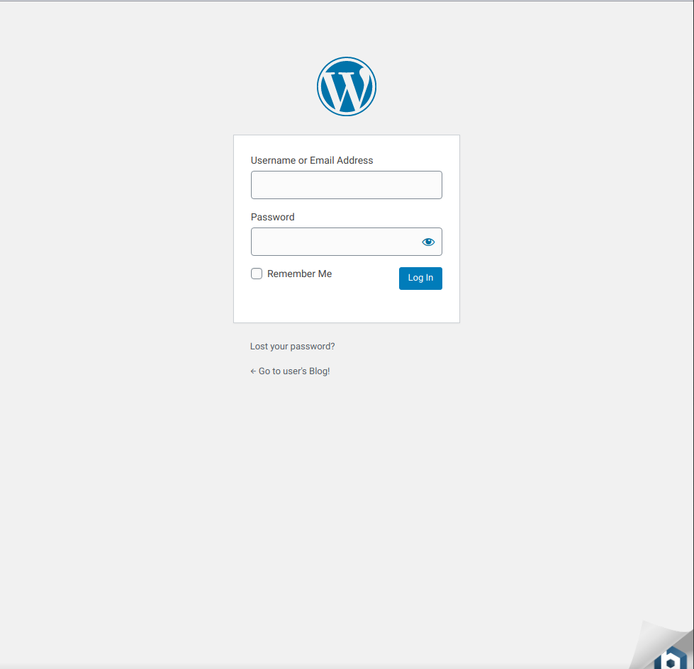
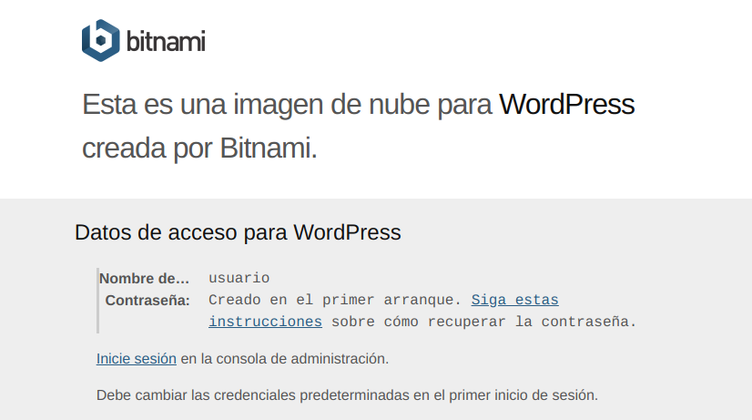
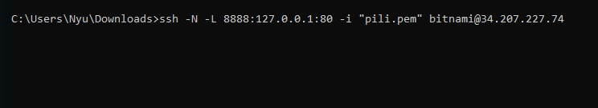
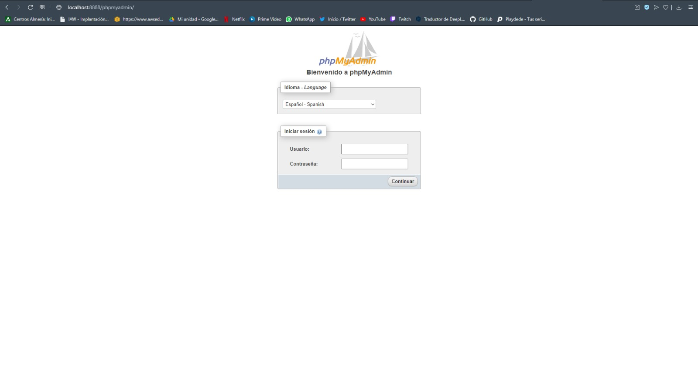

# Práctica 12: Amazon Machine Imagine (AMI) de Bitnami para Wordpress

En esta práctica vamos a crear una máquina en Amazon Web Service mediante una imagen AMI desde Bitnami.

Bitnami es una biblioteca de instaladores o paquetes de software para aplicaciones web y pilas de soluciones, así como dispositivos virtuales.

Dentro de su web cogeremos la AMI:

-  https://bitnami.com/stack/wordpress/cloud/aws/amis

Al pinchar en ella nos llevará a AWS y la configuraremos por ejemplo añadiendole los puertos. 

Después de esto tendremos nuestra máquina con Wordpress instalado. 



Para poder entrar dentro de Wordpress justo abajo a la derecha aparece el logo de Bitnami, pinchamos y ahí nos dirá que usuario y contraseña usar para entrar



Para la contraseña miraremos la documentación de bitnami sobre las credenciales de la aplicación, en ella encontraremos dos opciones para ella. 

- https://docs.bitnami.com/aws/faq/get-started/find-credentials/


## phpmyadmin
Para poder conectar con phpmyadmin tendremos que crear un tunel ssh ya que por razones de seguridad solo es accesible cuando se usa localhost. 

Con el siguiente comando hará el server un redireccionamiento:
```
ssh -N -L 8888:127.0.0.1:80 -i "pili.pem" bitnami@3.84.16.142
```


RESULTADO: 



Más información: 
- https://docs.bitnami.com/aws/faq/get-started/access-phpmyadmin/
